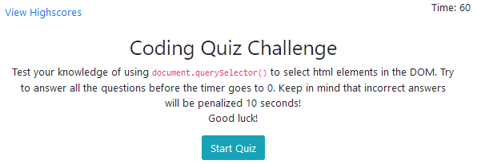
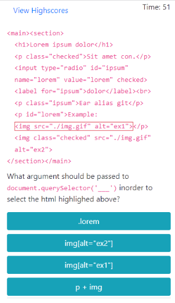
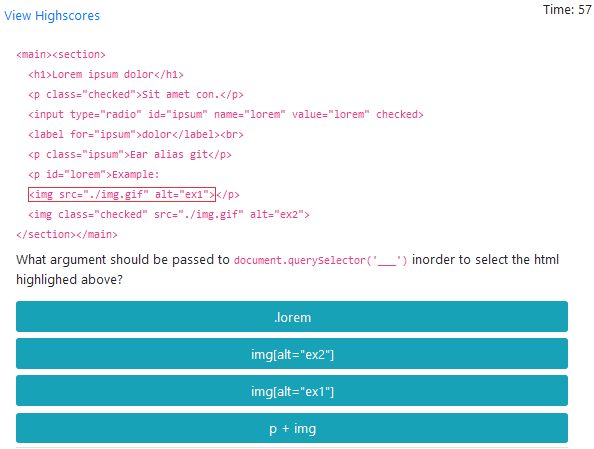
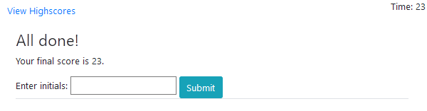
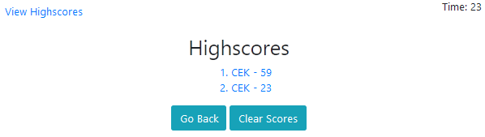
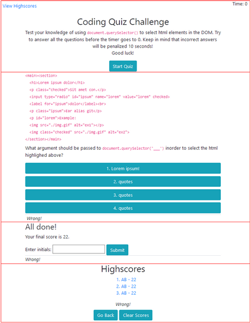

# querySelector_Quiz 

This app is a timed multiple-choice quiz that tests a user's knowledge of using `document.querSelector('sel')` to select HTML elements in the Document Object Model (DOM). The user will be given 60 seconds to answer 5 multiple-choice questions. For each wrong answer, 10 seconds will be deducted from the timer.

The quiz was written using HTML, Bootstrap, Javascript, and localStorage. 

## How to Play
Here's the start-up screen.

The timer in the top-right is initilaized to 60 seconds. In the background, 5 questions are randomly selected from a bank of 10 questions. 

Note, you can press `View Highscores` in the top-left at any time to view the list of highscores. If you click `View Highscores` while the quiz is in progress, the quiz will be aborted. 

Press `Start Quiz` to begin. 

You'll be shown a snippet of HTML code, a portion of which will be highligthed in a red box. Here's a screenshot on a small and large device. 

Your task is to identify which one of the multiple-choice selections will select the highlighted HTML. Click the button corresponding to your choice. Be warned; incorrect answers will be penalized 10 seconds on the timer! 

After your selection, the answer will be shown below the multiple-choice buttons. After 2 seconds, the quiz will advance to the next question. There will be a total of 5 questions, however the quiz will abort before that if the timer counts down to 0.

Once the quiz is complete, enter your initials and click `Submit` to save your score. Note, you can only enter letters and numbers in the initials field.

Upon submitting your score (or clicking on the `View Highscores` link), you'll be shown a list of the highscores.

Press `Clear Scores` to clear the list. 
Click `Go Back` to return to the start-up page.

## How it Works
Here I'll point out a few of the technical aspects behind the quiz.

### Modifying the CSS and DOM using Javascript
The HTML page consists of 4 main sections:
* start-up page
* quiz
* score submission page
* highscore page

All the sections can be seen below:

Javascript is used to display one of these sections and hide the rest by changing the CSS `display` property to either `none` or `block`.

In the multiple-choice portion of the quiz, you can see that a portion of the HTML is highlighted in red. This is done by adding (and then removing) the Bootstrap CSS classes `border` and `border-danger` to (from) ` elements` containing the HTML code to highlight.

For each question, Javascript is use to modify the `<button>` text via DOM manipulation. 

There is also a status `
` below the multiple-choice questions which is manipulated via Javascript to indicate 'Correct!', 'Wrong!' or '' as necessary.

### Event Delegation
Instead of placing an event listener on each multiple-choice button, the click listener is attached to the `
` containing all the multiple-choice `<button>` elements. Once a selection has been made by the user, `event.target` is used to identify the button pressed.

### Timers
In addition to the countdown-timer in the top-right, a couple other timers are used in the app. After each question is answered, the app automatically advances to the next question. However, `setTimeout()` is used to insert a 2sec delay before advancing to the next question. This delay allows the user to see the 'Correct/Wrong' message in the status field below the buttons. 

A similar delay is used after the user enters their initials before advancing to the highscores page.

### Input Validation
The highscores are stored in an array. Each entry of the array is a string of the initial and score separated by a dash: `["initials-score", "initials-score", ...]`. To avoid the user entering any dashes as part of their initials, I use validation to ensure the user enters only letters and numbers.

### localStorage
The highscores are stored in an `JSON.stringify()` array in localStorage. Consequently, the highscores are persistent through page reloads. 

## Try It
You can try the quiz [here](https://cek333.github.io/querySelector_Quiz/).
